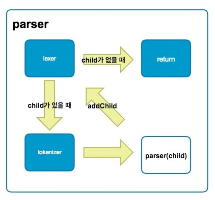

# JSON Parser

## 프로젝트 설명

* 자바스크립트 객체와 배열에는 다양한 타입을 담을 수 있다.

* JSON형태의 문자열을 토큰단위로 파싱해서 그 결과를 출력하는 프로그램이다.

  

  ### 실행 결과
  ~~~js
  var str = "[123, 22, 33]";
  var result = ArrayParser(str);
  console.log(JSON.stringify(result, null, 2));
  ~~~

  

  ~~~js
  { type: 'array',
    child: 
     [ { type: 'number', value: '123', child: [] },
       { type: 'number', value: '22', child: [] },
       { type: 'number', value: '33', child: [] } 
      ]
  }
  ~~~
  
  ~~~js
  var str = "{ 'codesquad' : 'is GOOD' }";
  var result = JSONParser(str);
  console.log(JSON.stringify(result, null, 2));
  ~~~
  
  ~~~js
  { 
    type : 'object',
    key : 'codesquad',
    value : 'is GOOD',
    child : []
  }
  ~~~

## 해결하려면 어떻게 해야할까?

1. 문자열로 된 데이터를 파싱가능한 형태로 변환한다.

   ~~~js
   "[1,2,3]" ==> [1,2,3]
   ~~~

2. 분석한 결과를 객체형태로 만들어준다.

   ~~~js
   'crong' ==> { type : string, value : 'crong', child : []}
   ~~~

3. 객체는 key와 value값이 있고, 배열은 index와 element값이 있다. 

   value값과 element를 분석한 객체형태의 결과값을 child에 추가해준다.

   ~~~js
   ['crong', 'pobi']
   1 { type : array, value : 'ArrayObject', child : []}
   2 { type : string, value : 'crong', child : []}
   3 { type : string, value : 'pobi', child : []} 
   ~~~

   배열 1번의 child가 문자열 2번과 3번이기 때문에 2번과 3번을 1번 child의 원소로 넣어준다.

   

## 어떻게 만들까?

### 프로그램 전체흐름

------

1. lexer를 통해 데이터를 분석한다 ex ) { type : number, value : 123, child : [ ] }

2. child가 없을 경우에는 그냥 리턴한다.

3. child가 있을 경우에는 tokenizer를 통해 데이터를 배열이나 객체형태로 변환시켜준다.

   ex ) "[ 1 ,2 ]" ==> [ 1, 2 ]

4. 변환된 데이터의 모든 원소를 parser하여서 lexer의 child에 추가해준다.

### 문자열로 된 데이터를 배열이나 객체로 변환 (tokenizer)

--------

1. 문자열로 된 데이터를 문자한개한개를 한개의 원소로 가지고 있는 배열로 변환해준다.

   ex) "[1,2]" => ['1', ',' , '2' ]

   

2. 만약 변환된 배열에서 bracket( '[' , '{', ']', '}' )인 원소를 가지고 있다면

   그 사이 원소를 다 합해줘서 한개의 문자열로 만들어준다.

   ex) [ '[', '1' , ',' '2', ']' ] ==> [ "[1, 2]" ]

   ex) [ '{' , 'a' , ':', "'crong'" ,'}'] ==> [ "{ a : 'crong' }" ]

   

3. 배열일 경우 ','를 기준으로 원소를 나누어 배열을 만들어준다.

   ex) [ '1' , ',' , '2' , ',' , '3' , '4' ] ==> [ '1' , '2' , '34' ]

   

4. 객체일 경우는 ':' 를 기준으로 key와 value값을 나누어 주고

   문자 ',' 을 기준으로 원소를 나누어 객체를 만드 만들어준다.

   ex) [ 'a' , ':' , "'crong'" , ',' , 'b' , ':' , "'pobi'"] ==> { a : 'crong' , b : 'pobi' }

### 데이터 분석 (lexer) { } 객체단위  

---

1. key값이 type, value, key, child인 객체를 만들어준다. ( key는 있을 때에만 만들어준다. )

2. type의 value값은 파라미터의 type이다. 

   ex ) lexer('123') ==> { type : ' number ' }

   ex ) lexer('[ ]') ==> { type : ' array '}

3. value의 값은 array와 object를 제외하고 파라미터의 값과 같다.

   ex ) lexer('123') ==> { value : 123 }

   ex ) lexer(" 'crong' " ) => { value : "'crong'" }

   ex ) lexer( ' [ ] ') => { value : 'ArrayObject' }

4. key의 값은 있을 때만 추가한다.

   ex ) lexer( 123, woogie ) ==> { type : 'number', value : 123, key : woogie }

5. child의 값은 디폴트값으로 [ ] 빈배열로 하고, child가 있는 경우에 추가하도록한다.

### 프로그램 실행 (parser)  [ {}, {}, {} ] 배열단위

---

1. 인자로 받는 문자열의 데이터가 객체형태인지 배열형태인지 그 외의 형태인지 판단한다.
   * 배열형태의 데이터이면 배열로 변환시켜준다음에 배열의 원소를 분석한 값을 child에 추가해준다.

   * 객체형태의 데이터이면 객체로 변환시켜준다음에 객체의 원소를 분석한 값을 child에 추가해준다.

   * child가 없는 데이터이면 바로 값을 리턴해준다.

## 느낀점

1. javascript의 특징에 대해서 잘 알게 되었고, ES6문법에 대해서 많이 알게 됐다.
2. 스택구조에 대해 잘 알게 됐다.
3. exports, require라는 파일을 불러와도 사용할 수 있는 것을 새롭게 알게 됐다.
4. 클래스를 어떻게 사용하는 지 어떻게 불러서 사용할 지 재사용하기 위해 어떻게 분류할 것 인지 많이 알게 됐다.
5. 함수를 어떤 기준으로 나누어야하며, 함수의 동작과 함수명이 일치해야하고, 하나의 함수에 한개의 동작을 한다라는 명확한 기준을 세우게 됐다.

